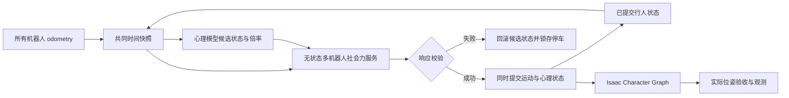

# 普通行人多机器人避让

`multi_sfm` 是独立的普通行人后端。每步使用全部机器人和行人的同一时间快照，求出社会力后同步积分行人。机器人由原来的 Nav2/外部控制链驱动。该模式不执行 HuNav 六行为树，也不修改稳定工作区的 HuNav 服务类型。

## 启动和范围

```bash
cd /home/lpc/workspace/arena5_multi_ws
source scripts/env.sh
scripts/build.sh
scripts/validate_offline.sh
scripts/run_multirobot.sh config/scenarios/two_robots_multi_sfm_1_nav2.yaml
# 六名普通行人：two_robots_multi_sfm_6_nav2.yaml
# 外部控制：two_robots_multi_sfm_1_external.yaml / two_robots_multi_sfm_6_external.yaml
```

新配置显式限制机器人为 0.26 m/s、1.0 rad/s；DWB、平滑器、恢复旋转、守护及 Isaac 均使用场景限制。原场景仍默认 1.0 m/s、1.2 rad/s。四机、高速和任意复杂场地不在本轮认证范围。

新场景显式使用 `physics_dt: 0.05`（20 Hz Isaac 物理/渲染），减少六角色渲染负载；普通旧场景保持 60 Hz。行人积分仍为 40 Hz，规范雷达仍为仿真时间 10 Hz，守护的墙钟期限保持不变。这些不同频率通过带时间戳的 odometry 插值对齐。

旧 YAML 默认 `pedestrian_backend: legacy_hunav`；旧 `hunav_profile: regular/six` 含义不变。新模式必须设置 `pedestrian_backend: multi_sfm`、`hunav_profile: none`、`pedestrian_config`（相对场景文件位置）、`psychology_model: noop` 和上述速度限制。两种后端互斥启动，统一的行人发布话题只有一个发布者。

## 运动和时间契约

每个行人受目标吸引、四面墙体排斥、其他行人社会力和每台机器人的社会力/近距离排斥。LightSFM 使用本仓库固定的 BSD-3-Clause 副本，来源与哈希在 vendor/SOURCE.json。总加速度上限 3 m/s²、行人速度上限 1 m/s。机器人半径 0.35 m，行人配置半径 0.4 m。近距离排斥使用实体半径计算净距，心理参数不能关闭这一项；它不是硬碰撞约束。社会力不是任意冲突条件下的无碰撞证明。

一次请求覆盖全部行人和机器人；只更新行人。内部行人 ID 为正数，机器人 ID 为负数。求力使用同一份步前状态，结果保留目标队列推进。场地尺寸来自现有 world YAML；首版只支持矩形边界、无分组普通行人。

odom 的速度由车体坐标转换到 map，五秒历史用于位置、速度和最短角插值。积分只前进到所有机器人已覆盖的共同时间，步长 0.025 s；不使用当前状态补算长段历史。生成角色后等候每台机器人收到新 odometry 才开始积分。

新模式显式启用 `ARENA_MULTI_CLOCK_ALIGNMENT=true`：实际角色位姿、规范雷达时间戳及行人指令延迟补偿统一读取发布 `/clock` 的 Isaac Graph 时钟。`World.reset()` 后 `World.current_time` 与该时钟可能有固定偏移，不能混用。旧模式关闭该开关。新模式每个渲染帧最多处理八个就绪 ROS 回调，避免两路墙钟速度指令与显示服务积压；旧模式保持每帧一个回调。时间戳允许提前 50 ms，并仅为浮点时间转纳秒增加 1 微秒数值容差；积分仍受共同已观测时间约束。

显示指令以最高 10 Hz 墙钟频率串行提交，并由角色在帧间进行有界外推。新模式的数据墙钟期限为 0.6 s，仿真时间戳期限为 1 s，计算及显示服务期限为 1 s。时钟回退、数值错误、积分滞后、服务错误会锁存故障，发布 unhealthy，并停止机器人及行人。重启场景恢复。计算携带 epoch/step，迟到响应不提交；Isaac 停止更新在先前在途更新之后发送，避免旧响应覆盖停止指令。

## 接口

| 接口                                 | 类型/语义                                                                            |
| ------------------------------------ | ------------------------------------------------------------------------------------ |
| `/multirobot/hunav/compute_agents` | `arena_multi_hunav_msgs/ComputeMultiAgents`；无状态计算，显式 dt、epoch、step      |
| `/multirobot/hunav/agents`         | `hunav_msgs/Agents`；权威运动状态，沿用原类型                                      |
| `/multirobot/hunav/robots`         | `hunav_msgs/Agents`；本步对齐的机器人输入                                          |
| `/multirobot/hunav/interactions`   | `InteractionForces`；逐人逐机器人作用力和净距                                      |
| `/multirobot/hunav/health`         | `std_msgs/Bool`；10 Hz 墙钟心跳，守护超过 0.5 s 未收到也停车                       |
| `/multirobot/hunav/status`         | `std_msgs/String` JSON；后端、故障、计数、计算及显示滞后                           |
| `/multirobot/hunav/psychology`     | `std_msgs/String` JSON；schema_version、模型版本、种子和状态                       |
| `/multirobot/hunav/actual_people`  | `arena_people_msgs/Pedestrians`；Character Graph 实际位姿，非 USD 根变换或请求位姿 |

服务请求中的 header.stamp 为积分开始时间，两个输入的时间戳相等且 frame 为 map；输出时间戳为开始时间加 dt。modifiers 必须恰好覆盖所有行人。调用者负责状态提交和串行请求；服务不维护另一个权威状态库。

## 人机社会力视野与独立近距离项

2026-10-07 更新保持原有事务和积分结构。每对行人与机器人分别计算：

```text
gap = center_distance - human_radius - robot_radius
F_near = away_direction * near_gain * exp(clamp((robot_clearance-gap)/near_sigma, -50, 10))
F_robot_pair = visibility * robot_scale * F_social + F_near
```

以下参数由 core `Config` 或 `multi_sfm_server` 同名 ROS 参数配置，所有行人共用，不来自心理模型；ROS 默认值直接读取 Config。现有参数默认值保持不变。

| 参数 | 默认值 | 约束与含义 |
|---|---:|---|
| `robot_clearance` | 0.10 m | 有限、≥0；指数力的参考净距，不是保证的最小间距 |
| `near_gain` | 10.0 m/s² | 有限、>0；参考净距处的近距离幅值 |
| `near_sigma` | 0.20 m | 有限、>0；指数衰减长度 |
| `robot_fov_deg` | 200° | 有限、(0,360]；总视野角 |
| `robot_fov_fade_deg` | 10° | 有限、[0,FOV/2]；每侧外缘的过渡宽度 |
| `max_acceleration` | 3.0 m/s² | 有限、>0；全部力合成后的向量模长上限 |
| `max_speed` | 1.0 m/s | 有限、>0；核心速度上限，现有适配器仍按 1 m/s 验证输出 |

视野以步前行人的 `yaw` 为中心，计算指向各机器人中心的相对方位。默认偏角绝对值 ≤90° 时权重为 1；90°–100° 线性减小；≥100° 为 0。本地原 HuNav `AgentManager::lineOfSight` 使用 `π/2+0.17` 的半角，即约 199.5° 总视野。选取 200° 保留前方与侧方感知，并通过每侧 10° 过渡避免硬边缘造成力跳变。它是角度模型，不包含遮挡、记忆或机器人侧视野。

`robot_fov_fade_deg=0` 为包含边界的硬视野；`robot_fov_deg=360` 恒取权重 1，过渡宽度不影响计算。人机中心完全重合时权重取 1，并沿用确定性几何方向及有限值保护。移动后的 yaw 沿用 LightSFM 速度朝向；速度精确为零时 core 包装层保留步前 yaw，避免原内核 `atan2(0,0)` 重置视觉朝向。Human–Human 社会力不使用此 FOV。

`F_near` 在所有方位存在，不乘 `robot_scale`、`space_scale`、其他心理倍率或 visibility，也不增加距离截断。背后机器人进入极近距离时仍有排斥。`/multirobot/hunav/interactions` 保持原消息结构，记录每对机器人社会力与近距离项的合力及净距，均在总加速度限幅前。

ROS 启动配置示例（不要与现有场景同时启动同名服务）：

```bash
ros2 run arena_multi_hunav_core multi_sfm_server --ros-args \
  -p robot_fov_deg:=200.0 -p robot_fov_fade_deg:=10.0 \
  -p robot_clearance:=0.1 -p near_gain:=10.0 -p near_sigma:=0.2
```

这些参数在服务启动时读取并捕获；运行中 `ros2 param set` 不会改变已捕获的积分 Config，需要带新参数重启服务。非法 Config 在计算时返回失败、原行人状态和空 influences，保持事务原子性。

### 参数对未来接近行为的限制

半径之和为 0.75 m 时，单机器人近距离幅值在中心距离 1.10/1.20/1.30/1.50 m 分别约为 2.865/1.738/1.054/0.388 m/s²，约 1.091 m 时单项达到 3 m/s²。总力可能与目标力相消或叠加，不能据此断言每个场景都会饱和。

独立 CPU 扫描见 `evidence/near_fov_20261007/README.md`。例如行人速度 0.8 m/s、期望速度 1 m/s、目标系数 2、松弛时间 0.5 s 时，目标加速度为 0.8 m/s²。关闭机器人社会力后，1.1 m 处前方单机器人的合加速度模长约 2.065 m/s²，后方约 3.665 m/s²，前方 ±30° 双机器人约 4.162 m/s²；后两者达到限幅。

当前 near 默认值适合延续既有普通行人的较保守避让，本轮保留它们。它们仍会限制未来 curious/threatening 主动接近：在上述行走状态下，即使 `robot_scale=0`，1.3 m 处的前方近距离项已超过 0.8 m/s² 的目标加速度。降低社会排斥不能解决该冲突。后续模型需要明确接近目标、目标力与停留距离，再用独立物理参数校准并复验净距、到达与限幅；不能由心理状态动态修改物理包络或将近距离项关闭。当前 multi_sfm 尚未实现这两类行为，此扫描不验证其行为学有效性。

## 心理模型扩展

`psychology.py` 定义版本 1 接口：initialize、step、reset、snapshot、restore。Context 包含时间、dt、行人/机器人状态、目标和带相对速度的邻居关系。MentalState 使用命名连续变量与命名舱室分量，未绑定 SIR/SEIR。模型 step 返回候选状态与 speed/social/robot/space 四个倍率，仅在运动计算成功后一起提交。



NoOpPsychology 是本轮唯一注册模型，倍率全为 1。后续模型实现协议并显式加入 MODELS 注册表及场景白名单。种子和内部随机状态应包含在 snapshot/restore 中；不得以墙钟推进心理状态。行为倍率每步相对基础配置重新计算，不得累乘；speed/social/robot 范围为 0–4。`space_scale` 保留消息、Python 协议及 `[1,4]` 校验以兼容调用者，但在当前 multi_sfm 中不影响运动；近距离项只读取独立的 core Config/ROS 物理参数。实体半径和硬速度上限始终不变。

本轮没有传播方程、感染率/恢复率估计或行为学有效性结论，也未把六行为的单目标状态机包装成多目标心理行为。

## 验证与回退

```bash
# CPU 确定性轨迹矩阵（不等同于 GPU 验收）
ros2 run arena_multi_hunav_core multi_sfm_benchmark 11 20
# 在单独域验证真实 ROS 节点的故障处理，不接触当前仿真
ROS_DOMAIN_ID=73 python scripts/validate_multi_sfm_faults.py --output-dir evidence/runs/multi_sfm/faults
# 已启动新场景后的只读实际位姿检查
python scripts/validate_multi_sfm_runtime.py config/scenarios/two_robots_multi_sfm_6_nav2.yaml \
  --duration 60 --output evidence/runs/multi_sfm/runtime.json
```

CPU 场景覆盖单台影响、静止阻挡、双向接近、交叉与间隙通行；每个人数/场景组合使用种子 11–20。调参种子为 1–3。最终状态以 evidence/multi_sfm 中的报告为准，缺失或失败的验收不算通过。

GPU 验收在每次启动后先运行 `python scripts/wait_multi_sfm_ready.py`，等到至少十次显示更新确认。六人 Nav2 场景依次执行局部地图清除与十轮双机目标；持续健康检查可与这些任务同时进行：

```bash
python scripts/validate_multi_sfm_clearing.py --duration 120 --output evidence/runs/multi_sfm/six_clearing.json
python scripts/benchmark_navigation.py config/scenarios/two_robots_multi_sfm_6_nav2.yaml \
  config/tasks/two_robot_lanes.yaml --output evidence/runs/multi_sfm/six_navigation.json
python scripts/validate_multi_sfm_runtime.py config/scenarios/two_robots_multi_sfm_6_nav2.yaml \
  --duration 1800 --output evidence/runs/multi_sfm/six_runtime_30min.json
```

清除探针要求机器人静止，使用实际角色位姿、按时间戳匹配的历史地图及规范雷达；只有确认 Nav2 栅格射线覆盖目标格及其膨胀范围内的邻近致命障碍格之后才计算清除期限；未被射线覆盖的区域另计，不宣称已清除。必须在导航任务之前运行。

分别重新启动一人、六人 external 场景后，可运行 `validate_multi_sfm_interaction.py SCENARIO --output REPORT.json`。该脚本会主动发布速度指令，检查出生位置后，让两台机器人在分开的相向路径各行驶三米并停车。它核验实际角色净距至少 0.10 m、显示误差至多 0.25 m、各行人到达首个路点，以及同一行人收到两台机器人的可测作用力。CPU 消融测试另行验证移除任一机器人会改变轨迹至少 0.10 m。

发布时 `verify_multi_sfm_release.py` 检查完整证据清单、报告哈希及 src/scripts/config 的源码摘要。`create_release.sh NEW_RELEASE_ID` 仅接受干净提交和全部通过的证据，再按原项目流程构建独立安装目录、生成 SHA256SUMS 并写保护。不会复用旧版 GPU 验收结论。

受保护发布目录需要把缓存和日志放在外部可写目录。显式选择发布版本启动，不修改原稳定入口：

```bash
release_root=/home/lpc/workspace/arena5_ws/optional/multirobot/releases/NEW_RELEASE_ID
export ARENA_MULTI_STATE_ROOT=/home/lpc/workspace/arena5_ws/.multirobot-multi-sfm
"$release_root/scripts/run_multirobot.sh" "$release_root/config/scenarios/two_robots_multi_sfm_6_nav2.yaml"
# 在另一个终端设置相同的 ARENA_MULTI_STATE_ROOT 后清理：
"$release_root/scripts/cleanup.sh"
```

本次发布 ID 为 `20260929-multi-sfm-v1`。独立冷缓存验证中，首次启动曾超过角色生成后的 30 秒就绪期限并触发 `post_spawn_odometry_timeout`；缓存初始化后，清理该次进程并以相同命令重启恢复。该保护锁存后不会自动恢复，机器人保持停车。启动期与运行期的超时均未因这次复测放宽。发布后独立运行记录另存于 `evidence/multi_sfm/release_validation/`，避免修改已写保护的发布文件。

稳定工作区只读。构建、启动、发布前检查原 underlay 基线；禁止为绕过差异刷新基线。发布使用干净提交、固定 ID、文件哈希和写保护，新证据独立于旧 P0–P5 记录。退出本次登记的进程，在未加载新 overlay 的终端运行旧入口即可回退；旧发布包无需修改。

新模式的局部激光观测采用 Nav2 二维 ObstacleLayer，保留原规范雷达的 marking/clearing 和 0–2 m 高度过滤；配置键 voxel_layer 为兼容既有生成结构而保留。旧模式仍使用 VoxelLayer。
