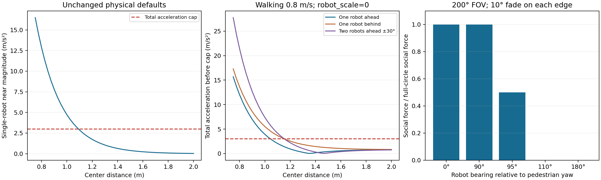

# 独立近距离排斥与逐对 FOV 验证（2026-10-07）

本目录是新源码的 CPU 和隔离 ROS 验证记录，未运行 Isaac/GPU 场景，也未实现 curious 或 threatening 心理模型。旧发布及其验收记录保留原状。

## 基线与结果

- 基线提交：`f330dfcd29c6a1f711e3f091798e36852fac742d`，标签 `backup-near-fov-20261007`。
- `validation/build.log`：7 个 overlay 包构建通过，存在工具链 CMake 弃用/策略警告。
- `validation/offline.log`：underlay 基线、场景配置、HuNav 配置和固定 LightSFM 哈希校验通过；40 项 Python、21 项 C++ 测试通过。
- `validation/cpu_benchmark.json`：120 组既有轨迹测试全部通过，最小净距 0.218552 m；保留原有到达、0.10 m 净距和机器人消融测试阈值。
- `validation/ros_parameters.json`：独立 ROS 域 78 的 5 项真实服务测试通过，覆盖默认值、360°、窄视野、独立物理参数和非法 FOV 原子失败。失败响应使用序列化字节比较，避免 ROS float32 在 Python 中往返舍入影响相等判断。
- `validation/restore_check.json`：完整基线解包目录的 9,629 个条目与快照 manifest 相符。备份位置及完整回退命令见 `docs/RECOVERY.md`。

## 实验设计

`assess.cpp` 直接调用实际 core `integrate()`。单行人半径 0.4 m，机器人半径 0.35 m，世界 30×23 m，行人位于 (15,11.5)，yaw=0，目标 (25,11.5)，期望速度 1 m/s；目标、墙体、社会力系数分别为 2、10、5。机器人静止。

扫描中心距离 0.75–2.0 m，间隔 0.025 m；行人初始速度为 0 或沿目标方向 0.8 m/s；`robot_scale=0/1/4`。布局为无机器人、前方 0°、后方 180°、侧方 90°、过渡区 95°、盲区 110°，以及前方 ±30°、后方 ±150°、前后各一台、过渡区 ±95° 四种双机器人布局。每个配置共 3,060 个案例。

每个案例分别调用原配置、`robot_scale=0` 消融和高加速度上限 Config（1e6 m/s²，仅用于观测原始合力）。通过消融结果取得 near 向量，再从逐机器人合力中减去 near 得到实际社会项。实验步长 0.001 s，执行时检查速度未达到 1 m/s 限幅，使前后速度差能够反映积分加速度。每对 near 的模长均核验符合物理公式。CSV 记录 near 模长之和、near 净向量、社会净向量、机器人合力、限幅前后合加速度和饱和标记；模长之和与净向量分开记录以保留相消信息。

三组数据为：

| 文件 | 核心配置 |
|---|---|
| `scan.csv` | 新版默认 200° FOV，每侧 10° 过渡 |
| `full_circle.csv` | 新版 360° FOV |
| `baseline.csv` | 从基线 Git 提取并独立编译的原 core 和 Config |

360° 新版与基线的全部 CSV 数值字段最大绝对差为 **0**。此结论只覆盖该扫描，不包含零速度朝向修复或任意轨迹的等价性。默认配置所有案例的实际加速度模长 ≤3 m/s²（最大浮点结果约 3.000000000000021）。`summary.json` 保存范围、默认参数、比较结果及代表性案例，`manifest.json` 保存源码及数据文件哈希。

## 对参数设计的判断

保持 `robot_clearance=0.10 m`、`near_gain=10.0 m/s²`、`near_sigma=0.20 m`。`robot_scale` 原本已与 near 解耦；本次移除 `space_scale` 耦合，并保留其接口和 `[1,4]` 校验。

| 中心距离 | 单机器人 near 幅值 |
|---:|---:|
| 1.10 m | 2.865 m/s² |
| 1.20 m | 1.738 m/s² |
| 1.30 m | 1.054 m/s² |
| 1.50 m | 0.388 m/s² |

在初速度 0.8 m/s、`robot_scale=0` 时，目标加速度为 0.8 m/s²，1.1 m 处的合力结果为：

| 布局 | 限幅前加速度模长 | 是否饱和 |
|---|---:|---|
| 前方单机器人 | 2.065 m/s² | 否 |
| 后方单机器人 | 3.665 m/s² | 是 |
| 前方 ±30° 双机器人 | 4.162 m/s² | 是 |

不能把 near 强度与最终饱和等同。静止、无机器人时，默认目标力本身产生 4 m/s² 原始加速度，也会触发上限；其他几何下 near 可能与目标力相消。

现有 near 确实会约束主动接近：在上述行走状态下，1.3 m 处的前方 near 超过目标加速度，即使完全关闭社会排斥也可能减速。保留默认值是为了延续已验证的普通行人轨迹；未来接近模型应明确目标、停留距离与目标力，再单独校准物理参数并复验。此实验不构成其他心理行为已兼容或已失效的证明。

默认 FOV 总角度 200°，参考本地 HuNav 约 199.5° 的总视野；每侧 10° 线性过渡使侧方仍可见，减少边缘跳变。±90° 内社会力完整，±95° 为半权重，±100° 及更外侧为零。视野只作用于逐对机器人社会项；near 在后方及 `robot_scale=0` 时保持。



## 复现

从工作空间根目录运行（先完成 overlay 构建）：

```bash
source scripts/env.sh
python evidence/near_fov_20261007/run.py
MPLCONFIGDIR=/tmp/arena5-near-fov-mpl \
  /home/lpc/miniforge3/envs/isaaclab/bin/python evidence/near_fov_20261007/plot.py
ROS_DOMAIN_ID=78 python evidence/near_fov_20261007/check_ros.py
```

`run.py` 从现有 CMake 构建读取链接参数，将当前与基线核心编译到临时目录，不复用旧核心二进制。图表提供 PNG/PDF 独立文件。ROS 测试使用独立节点及服务名，结束时只终止自行启动的服务器。它可能需要沙箱外的本机 DDS socket 权限。
